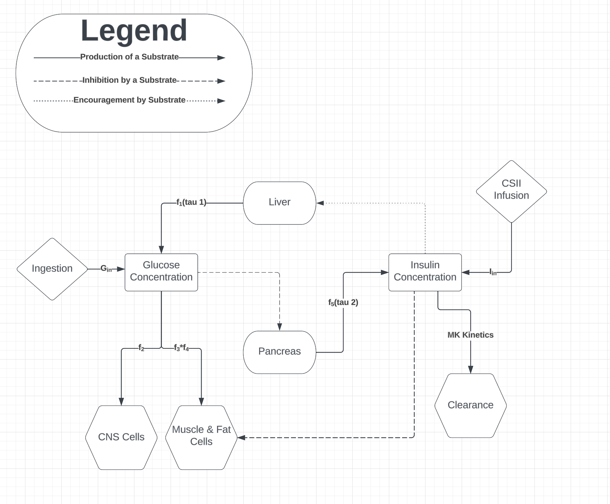

Robust MPC Artificial Pancreas System

Cells in the body break down glucose into ATP in order to generate energy. This glucose is absorbed from the blood stream via the hormone insulin. Diabetes Mellitus is an autoimmune disease characterized by the body's inability to produce sufficient levels of insulin. In Type 2 diabetes, the body's sensitivity to insulin is severely reduced, resulting in an insufficient supply of insulin in the blood stream. In Type 1 diabetes, the body loses its ability to produce insulin at all, resulting in no insulin in the blood stream. In both cases, the insufficient supply of insulin means cells in the body are not able to utilize the glucose in the blood stream which impairs cell function and leaves the concentration of glucose in the blood with no sink.  

In order to model the glucose-insulin dynamics in the body, Sturis Tolic Li Bortz and many others have developed a system of nonlinear delay differential equations based on a compartmental accounting of glucose and insulin absorption and production mechanisms. The system is built as follows and depicted graphically in figure 1.  

Glucose is added to the bloodstream in two main ways  
1. Ingestion - food is consumed and, through digestion, glucose is extracted into the bloodstream.
2. Hepatic production - low levels of glucose in the bloodstream and high levels of insulin trigger the release of stored glucose in the liver.

Glucose is removed from the bloodstream in two main ways
1. Utilization by CNS tissue - cranial nervous system tissue utilizes glucose without requiring 
2. Utilization by muscle and fat tissue - muscle and fat cells use insulin to uptake glucose from the bloodstream. 

Insulin is added to the blood stream in two main ways
1. Pancreatic production - the pancreas produces insulin in response to high levels of blood glucose concentration 
2. Infusion - in diabetic patients, synthetic insulin is injected into interstitial fluid and then absorbed into the bloodstream in response to high blood glucose concentration or in anticipation of a meal

Insulin is removed from the bloodstream in one main ways
1. Clearance - insulin in the bloodstream is metabolized by the presence of human insulin degrading enzyme (IDE) 

